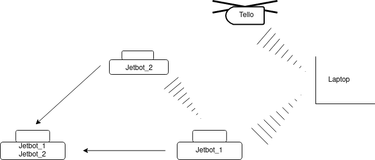
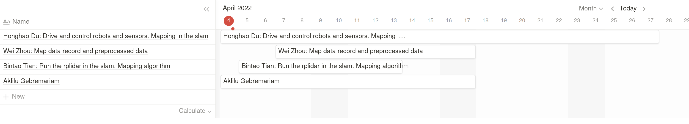

# RAS-mapping-environment

UTU RAS open project

## Open Project Plane

1. Team name and team members

    Honghao Du	

    Wei Zhou
    
    Bintao Tian
    
    Aklilu Gebremariam

2. Application / Use-case

    Objective application: Mapping unknown environment.

    Reason: It is an interesting topic for us and we will have chance to use some lidar equipments.

    We are able to navigate an unknown environment.
    
    Perform a synchronized choreography.
    
    Data will be shared in both directions between at two or more robots.

3. The system

    - Robots, computing platforms and other major elements.
        - Jetbot or MyAVG, Tello drone, slam, ubuntu 20.02, ROS noetic or ROS2.
    - Sensor suites.
        - Rplidar, UWB.
    - Communication.
        - Wifi, ROS_MASTER_URI.
    - Algorithms.
        - Path planning, Mapping, Sensor fusion.
    - Data flow.
        - With laptop, robots and tello drone.

        

4. GitHub repo link

    https://github.com/HonghaoDu/RAS-mapping-environment

5. Background

    Already know: Slam, ROS, Rplidar, Mapping

    Most confident: Run the rplidar and mapping in the slam
    
    The riskiest: Navigate in unkown environment, optimize algorithm

6. Expected challenges and wishes to learn

    Investigation: Mapping algorithm, Image fitting, Imu
    
    Challenges: Algorithm, Navigation
    
    Learning: Pathing planning, Navigation, Slam, more lidars, Multiple robots control
    
    Algorithm: Mapping

7. Team roles

    Honghao Du: Drive and control robots and sensors. Mapping in the slam.

    Wei Zhou: Map data record and preprocessed data.
    
    Bintao Tian: Run the rplidar in the slam. Mapping algorithm.
    
    Aklilu Gebremariam: (update later)

8. Work packages, with tentative project schedule.

    Menbers update each other regularly on their work progress, and hold regular offilne meetings at least once a fortnight for project progress review and outlook. The initial deployment of rplidar and mapping algorithms on top of slam will be completed within two weeks. It spends on data anaylsis and processing, and the remaining time is spent on algorithm optimization.

    

9. Description of final experiment or demonstration

    Control robots in the unkown environments, for example ICT City first floor and 6th floor, scan and mapping in the slam. If it is possible, we will try navigate on the map after mapping with 2 or more robots.
